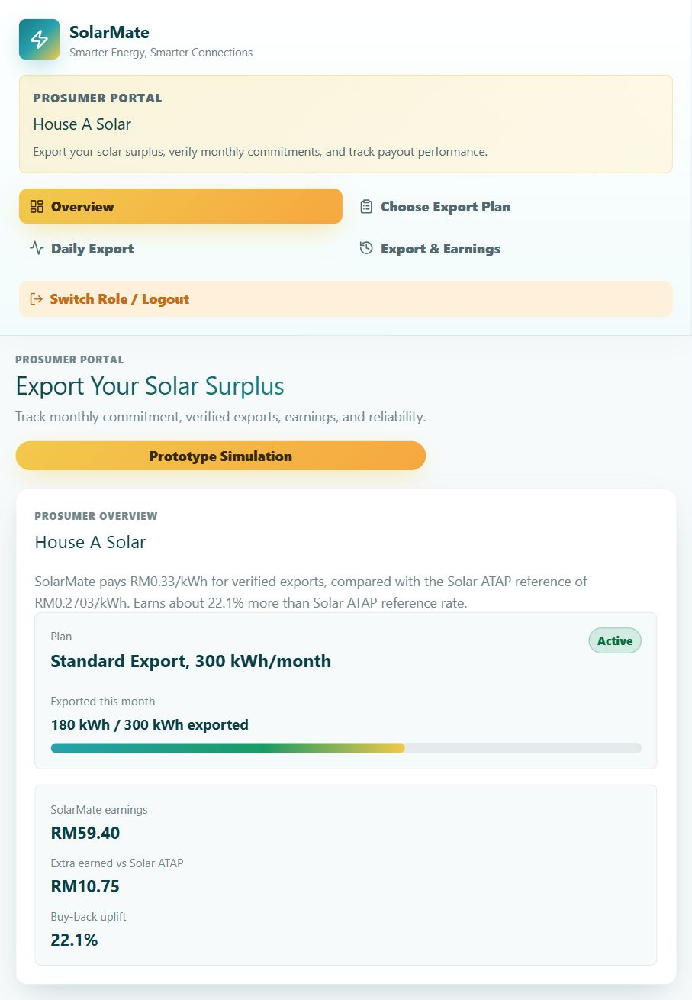
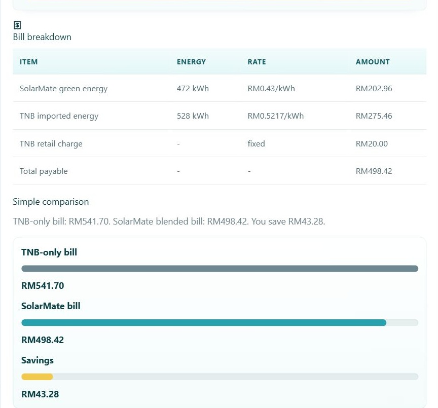
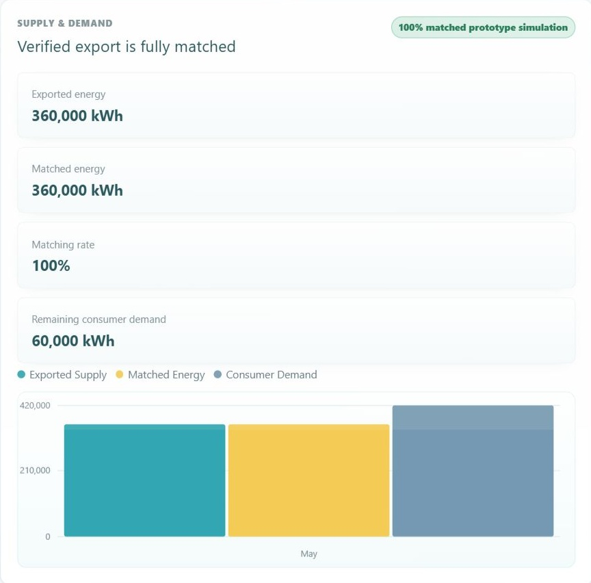
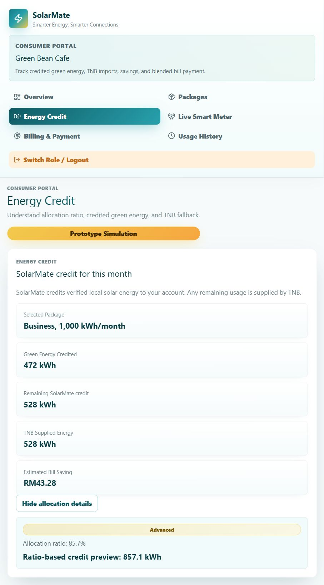
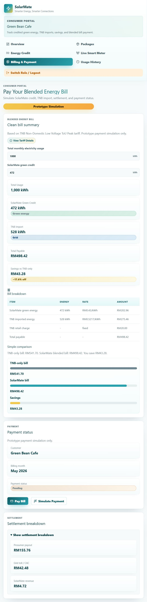
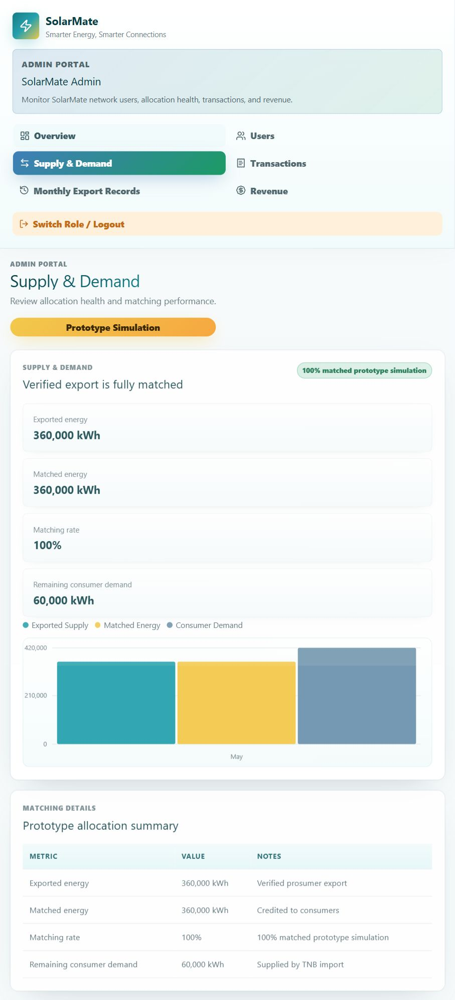
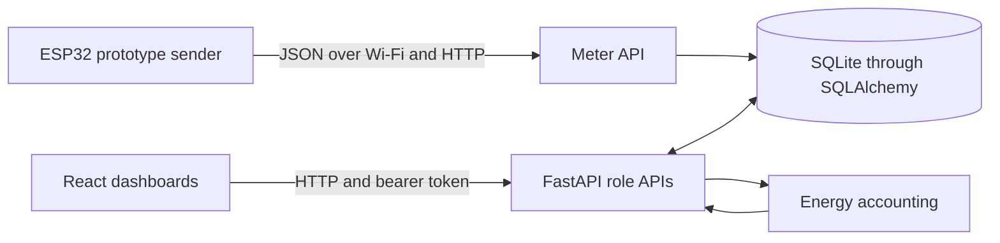

# SolarMate ☀️

### Community solar sharing, explained through energy credits

**An engineering project by Chan Zhi Hong** 
Electrical Engineering, Universiti Malaya

**UM Technothon · Top 15 among 50+ teams · May 2026**

[Walkthrough](#project-walkthrough) · [Architecture](#architecture) · [Technical notes](docs/technical-walkthrough.md)

---

## About this showcase

This public repository presents SolarMate through screenshots and an engineering walkthrough. The application, backend and embedded source code remain in a separate private repository.

## The idea

A household can generate more solar energy than it uses, while a nearby business still relies on grid electricity. SolarMate explores how a community platform could account for that surplus and credit its value to consumers.

Producers follow their export commitments and earnings. Consumers see their solar credit, remaining grid imports and blended bill. An administrator follows the wider supply and demand picture.

This is a prototype for exploring energy sharing and its accounting. The prices and energy volumes in the walkthrough are illustrative.

## My contribution

I designed the competition platform and its generation, consumption and transaction dashboards. I also developed the Python/SQL backend for users, energy listings and trades. Our team reached the Top 15 among more than 50 teams at UM Technothon.

The private implementation has since developed into a React application with a FastAPI/SQLite backend and an ESP32 telemetry path. That continuation connects my interest in power systems with the practical work of building interfaces and handling data.

## Project walkthrough

**Screenshot context:** These captures show the standalone React demonstration opened for the portfolio walkthrough on 3 October 2026. It uses mock data. The backend and ESP32 sections below describe the private implementation. The screenshots do not establish a running hardware connection or verified market performance.

### 1. Producer view: an export commitment and its earnings

The producer follows a monthly export plan and compares illustrative earnings. This makes the relationship between exported energy and payment easy to follow.

  

### 2. Consumer view: solar credit and grid imports share one bill

The example customer uses **1,000 kWh**, with **472 kWh of solar credit** and **528 kWh of grid imports**. Under the prototype's rate assumptions, the blended bill is **RM498.42**, compared with **RM541.70** for grid electricity alone.

That is a **RM43.28 saving**, approximately **7.99% of the total comparison bill**.

  

The settlement view divides the RM202.96 solar payment into RM155.76 for the producer, RM42.48 for the grid charge and RM4.72 for the platform. These amounts explain the prototype's accounting model.

### 3. Network view: matched exports and unmet demand

The illustrated network supplies **360,000 kWh** against **420,000 kWh** of subscribed demand. It matches all available export, leaving **60,000 kWh** of demand for grid supply. A 100% export matching rate describes the use of available exports, not the coverage of all demand.

  

<strong>More screenshots: allocation, full billing and network views</strong>

#### Energy allocation

The expandable preview uses available export divided by subscribed demand. The screenshot's 472 kWh credited total and 857.1 kWh preview belong to separate mock scenarios. They do not represent one reconciled settlement.

#### Full billing and settlement

#### Full network view

## Architecture

The frontend sends authenticated requests to FastAPI. The backend stores account and energy records in SQLite through SQLAlchemy. A separate HTTP path accepts ESP32 prototype readings.

| Layer | Technology | Responsibility |
|---|---|---|
| Interface | React, JavaScript/TypeScript, Vite, TanStack Start | Producer, consumer and admin dashboards |
| API | Python, FastAPI, Pydantic | Account, role, meter, billing and wallet endpoints |
| Storage | SQLAlchemy, SQLite | Profiles, energy records, meter readings and wallet records |
| Embedded prototype | ESP32, Arduino C++, Wi-Fi, HTTP | Send voltage, current, power and accumulated energy |
| Accounting | JavaScript functions and Python energy helpers | Credit limits, grid imports, bills and earnings |

## Engineering details

### Energy allocation and billing

The standalone demo previews credit in proportion to available export and subscribed demand. It caps the preview at the package allocation. Billing caps credited energy at usage and calculates the remaining grid imports.

The backend additionally aggregates database records into monthly supply and demand summaries, limits matching against available supply and applicable quota, and records the corresponding payout and revenue totals.

All prices below are **prototype assumptions**, not a statement of current electricity tariffs:

| Example bill component | Calculation | Amount |
|---|---|---:|
| Solar energy | 472 kWh × RM0.43/kWh | RM202.96 |
| Grid imports | 528 kWh × RM0.5217/kWh | RM275.46 |
| Fixed charge | Monthly reference charge | RM20.00 |
| **Blended total** | Sum of the above | **RM498.42** |

### ESP32 telemetry

The sender calculates power using `P = V × I` and accumulates watt-hours using elapsed time. It posts a JSON reading to the meter API every five seconds. The API accepts the electrical quantities, associates the device with its producer profile and stores a timestamped reading.

The included sketch **generates sample voltage and current values by default**. Its comments suggest replacing those values with INA219 sensor readings. The backend also amplifies small prototype energy values for demonstration. That scaled quantity is separate from a physical Wh-to-kWh conversion.

### What I learned

An energy dashboard needs a clear definition behind every number. Generated energy, exported energy, customer credit and billed energy describe different stages of the system. Building SolarMate gave me practice connecting those stages, keeping their units clear and explaining how a change in one quantity affects the bill.

## Current scope

The private implementation includes application accounts, API calls, database models and a prototype telemetry path. Local demo data, wallet operations and billing support the presentation workflow. They do not demonstrate an operational energy market, real payment processing or calibrated household metering.

The next engineering step is to reconcile allocation previews and credited totals against a single settlement dataset, then validate the telemetry path with measured sensor data.

## Explore the presentation

- [Detailed technical walkthrough and presentation script](docs/technical-walkthrough.md)
- [Screenshot gallery](docs/screenshots)

This showcase contains documentation and screenshots. The runnable application and setup instructions remain with the private implementation.

---

**Chan Zhi Hong** 
I welcome conversations about embedded systems, robot electronics and engineering projects.

[GitHub](https://github.com/aidanchan0623) · [LinkedIn](https://www.linkedin.com/in/zhi-hong-chan-821029313/)
